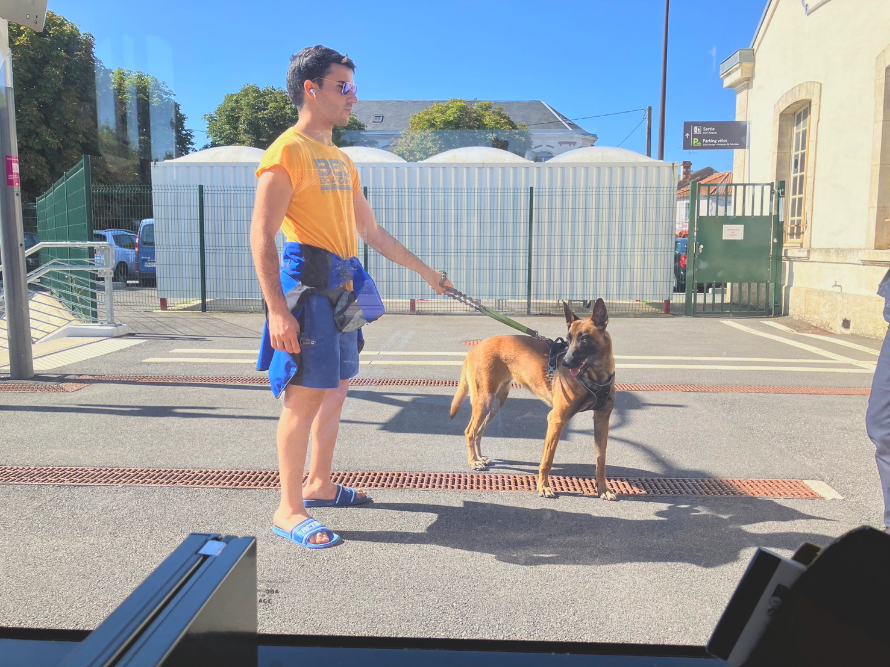

# 2024_paris5

<html lang="ja">
 <head>
  <meta charset="utf-8" />
 

<link href="https://cdnjs.cloudflare.com/ajax/libs/lightbox2/2.7.1/css/lightbox.css" rel="stylesheet">
   
</head>
<!--
<body onload="alert('65歳まで、よく頑張りました！　まだまだ元気に〜〜(^o^)/')" onunload="alert('再会の時まで、元気でお過ごしくださいませ〜(^o^)/')">
-->

  モバイル端末をお使いの場合は、画面を横向きにするとより見やすくご覧頂けます。

<!--
-->

<a href="https://torokoid.github.io/2024_paris/">2024年7月19日〜21日</a>><a href="https://torokoid.github.io/2024_paris2/">22日〜23日</a>><a href="https://torokoid.github.io/2024_paris3/">22日〜23日</a>>24日〜
<!--
-->

 &nbsp;Bruce 24日〜

<!--
<h2><a href="https://torokoid.github.io/list">クラス会名簿リンク</a></h2>
-->
  

 アクセス用QRコード

<marquee direction="right" scrollamount="20" width="30%">(^_^)/~hada</marquee>

<h2><marquee behavior="left">!!! 2024年7月25日、ボルドーからナントに移動して、なでしこジャパンのスペイン戦を含むフランス情報 !!!</marquee></h2>
<!--

-->
<!--
<h3> ～～～2024年7月25日着の画像です！～～～  </h3>
-->          
<h3> ～～～今、ここにいます。ナントまで、あと約2時間。電車で犬と旅行している人～～～  </h3>

<h2><marquee behavior="left">!!! 早朝BordeauxからNantesへ電車移動 !!!</marquee></h2>

<h2><marquee behavior="left">!!! Nantes到着 !!!</marquee></h2>

<h3> ～～～フランスの大統領元～～～  </h3>

<h2><marquee behavior="left">!!!買い物は続く。ワイン博物館に行ってから、スタジアムに行くことになった!!!</marquee></h2>

<h3> ～～～スタジアム行きバス停には、地元ボランティアが案内してくれました～～～  </h3>

<h2><marquee behavior="left">!!!まさかの快勝!!!</marquee></h2>

<h3> ～～～帰りのバス、子供のハチマキに南相馬の文字 
夕食はTATAKI～～～  </h3>

      

                             

                             
        

  

 

<!-- フッタ -->
 <footer>
 <h3>Copyright 2024/Jul/26 S.Hada</h3>
 </footer>
